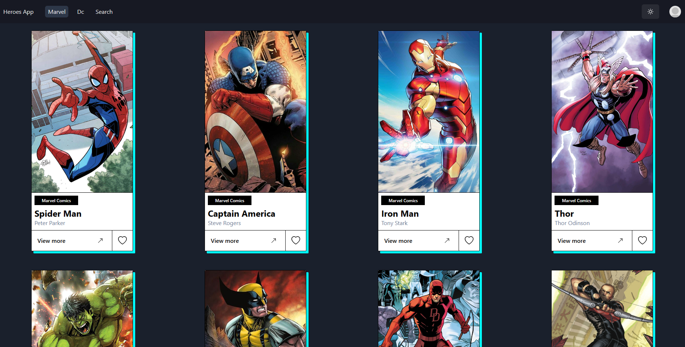

# Heroes App



Heroes App is a web application built with React, React Router DOM, Yarn, AOS, and Chakra UI that allows users to explore a database of superheroes and supervillains. Whether you're a fan of Marvel, DC Comics, or other franchises, Heroes App has you covered. You can search, view, and learn more about your favorite characters, or discover new ones.

### Features

- Search Superheroes: Easily find superheroes or supervillains by name, affiliation, or other attributes.
- Detailed Profiles: Access detailed profiles of each character, including their origin, abilities, and more.
  Favorites: Mark your favorite characters for quick access.
- Slick UI: Heroes App is designed with Chakra UI, making it visually appealing and responsive.

### Technologies Used

- React: A popular JavaScript library for building user interfaces.
- React Router DOM: For routing within the application.
- Yarn: A fast, reliable package manager for managing project dependencies.
- AOS (Animate On Scroll): Adds smooth animations to page elements as you scroll.
- Chakra UI: A modular component library for designing responsive and accessible web applications.

### Getting Started

Follow these steps to get the Heroes App up and running on your local machine:

1. Clone the repository:

   ```bash
   git clone https://github.com/ismanolgarcia/heroesapp.git
   ```

2. Change into the project directory:

   ```bash
   cd heroesapp
   ```

3. Install the project dependencies using Yarn:

   ```bash
   yarn
   ```

4. Start the development server:
   ```bash
   yarn dev
   ```
5. Open your browser and navigate to http://localhost:5173/ to use Heroes App.

### Usage

- Use the search bar to find your favorite heroes or villains.
- Click on a character to view their detailed profile.
- Add characters to your favorites for quick access.

### Contributing

We welcome contributions to make Heroes App even better! If you'd like to contribute, please follow these guidelines:

- Fork the repository.
- Create a new branch for your feature or bug fix.
- Make your changes.
- Test your changes thoroughly.
- Create a pull request with a clear description of your changes.

### Acknowledgements

The Heroes App project is built with the support of the open-source community.
We appreciate the contributions of developers using React, React Router DOM, Yarn, AOS, and Chakra UI.
Enjoy exploring the exciting world of superheroes and supervillains with Heroes App. If you have any questions, issues, or suggestions, please feel free to open an issue or contact us. Happy hero hunting! 👊💥
